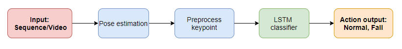

# Fall detection
This branch relate to training model fall detection

## Pipeline

+ Video/stream -> Pose estimation(TensorRT) -> Skeletons -> Preprocess -> LSTM classifier -> Normal/Fall

## Performance
+ FPS: 
    + Video ~ 30-35FPS
    + Stream ~ 20-22FPS
+ Accuracy:
    + Precision: 96%
    + Recall: 90%

